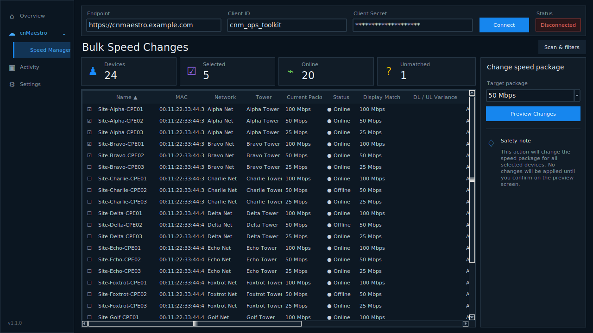

# Operations Toolkit 1.2.1

Operations Toolkit includes the working cnMaestro Speed Manager with the approved compact service/tool navigation. Version 1.2.1 corrects the v1.2.0 visual shell while preserving cnMaestro API and operational behavior from the v1.1.0 baseline.

## What changed in 1.2.1

- Replaced the v1.2.0 card dashboard with the approved compact sidebar.
- Added the service/tool hierarchy: **Overview**, expandable **cnMaestro → Speed Manager**, **Activity**, and **Settings**.
- Preserved the v1.1.0 cnMaestro API class, TLS behavior, package logic, scan/filter/selection/preview/publish/audit/cache/update behavior, and dependencies.

No cnMaestro API or backend behavior was redesigned for this release. Version 1.2.0 is superseded but remains available in GitHub release history.

## Included v1.1.0 behavior

- Optional closest-downstream package suggestions with adjustable tolerance and visible DL/UL variance. Exact package remains authoritative.
- Sortable columns.
- Persistent checkbox selection across filters, with select/deselect visible and selected-only view.
- Publish progress bar, per-customer stage, success/failure counters, and completion popup.
- System, Light, and Dark appearance modes from the v1.1.0 baseline.

## Run from source

On Windows, run **Launch Operations Toolkit.bat**. Expand **cnMaestro** and select **Speed Manager**. Keep write actions disabled during validation.

The pinned dependencies are listed in `requirements.txt`.

## Build the Windows executable

Run `build_windows.bat`, or use the equivalent command after installing `requirements.txt`:

```powershell
pyinstaller --noconfirm --clean --onefile --windowed --name "Operations-Toolkit-v1.2.1" cnmaestro_speed_manager.py
```

The executable is written to `dist\Operations-Toolkit-v1.2.1.exe`.

## Regression guard

`release_checks/ast_behavior_guard.py` compares the API class and nonvisual operational methods with the original v1.1.0 source by AST. CI also checks Python syntax/import, builds the Windows one-file/windowed executable, and launches and closes the GUI briefly with preview mode enabled and without making cnMaestro calls.

## Approved interface



## Approximate matching safety

Approximate matching changes display/grouping only. Preview retains actual live QoS. The downstream tolerance defaults to 10%. Upload variance is shown but does not determine the suggestion.
