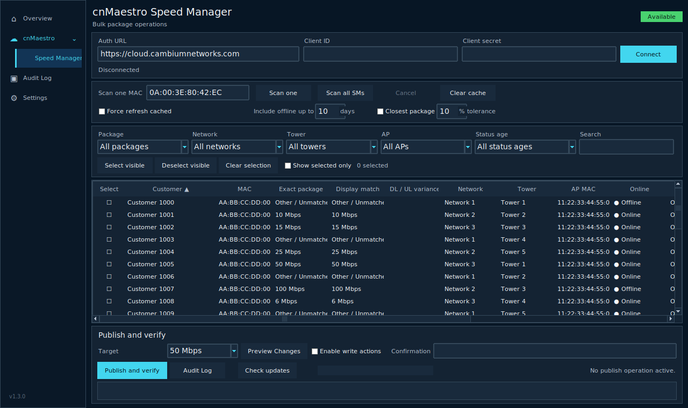
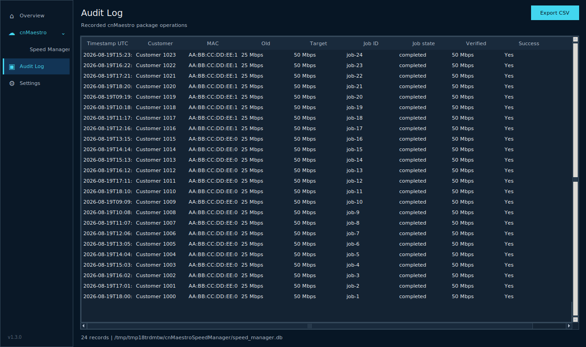
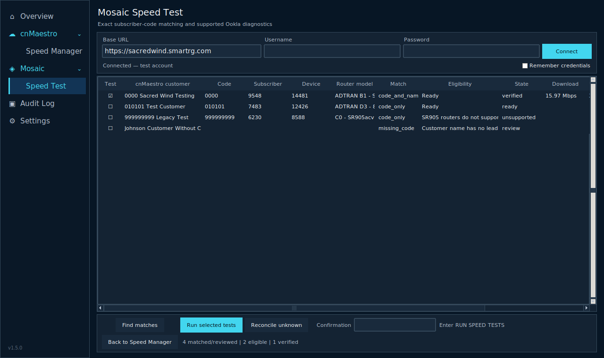
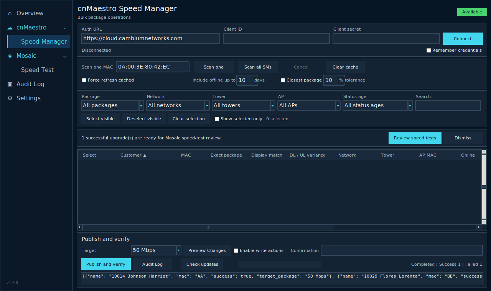

# Operations Toolkit 1.5.0

Operations Toolkit 1.5.0 is a local candidate that preserves the working cnMaestro Speed Manager and adds a separate Mosaic Speed Test module with an explicit post-upgrade handoff.

## What changed in 1.5.0

- Added nested **Mosaic > Speed Test** in-app navigation using the existing dense dark workspace.
- Matches cnMaestro customers to Mosaic by an exact leading subscriber code; normalized customer names are confidence checks only. Missing, duplicate, and multi-device matches remain operator-review states.
- Adds capability preflight and clearly marks unsupported routers such as SR905acv instead of offering a test action.
- Adds an in-app handoff after successful cnMaestro upgrades; it never starts tests automatically.
- Runs explicitly selected supported Ookla tests sequentially, with a durable local journal and unknown-outcome reconciliation.
- Mosaic passwords are optionally stored per Windows user in Windows Credential Manager, never plaintext, and never auto-connect.
- Preserves the cnMaestro API and guarded operational behavior from previous releases.

Older releases remain available in GitHub release history.

## Included v1.1.0 behavior

- Optional closest-downstream package suggestions with adjustable tolerance and visible DL/UL variance. Exact package remains authoritative.
- Sortable columns.
- Persistent checkbox selection across filters, with select/deselect visible and selected-only view.
- Publish progress bar, per-customer stage, success/failure counters, and completion popup.
- System, Light, and Dark appearance modes from the v1.1.0 baseline.

## Run from source

On Windows, run **Launch Operations Toolkit.bat**. Expand **cnMaestro** for Speed Manager or **Mosaic** for Speed Test. Keep remote actions disabled during validation.

The pinned dependencies are listed in `requirements.txt`; `keyring` uses the current Windows user's Credential Manager on Windows.

## Update checks

No sidecar file is required. The app checks the built-in Operations Toolkit `latest.json` manifest and, after confirmation, opens the approved release download in the browser. It does not replace or install the executable automatically.

To override the manifest URL, place a valid `update_config.json` beside the executable. See `update_config.example.json` for the optional format.

## Build the Windows executable

Run `build_windows.bat`, or use the equivalent command after installing `requirements.txt`:

```powershell
pyinstaller --noconfirm --clean --onefile --windowed --hidden-import keyring.backends.Windows --name "Operations-Toolkit-v1.5.0" cnmaestro_speed_manager.py
```

The executable is written to `dist\Operations-Toolkit-v1.5.0.exe`.

## Regression guard

`release_checks/ast_behavior_guard.py` compares the API class and nonvisual operational methods with the original v1.1.0 source by AST. The intentionally changed updater resolver/check path, credential/settings methods, and in-app visual navigation are covered by focused tests. CI also checks Python syntax/import, builds the Windows one-file/windowed executable, and launches and closes the GUI briefly with preview mode enabled and without making cnMaestro calls.

## Approved interface









## Approximate matching safety

Approximate matching changes display/grouping only. Preview retains actual live QoS. The downstream tolerance defaults to 10%. Upload variance is shown but does not determine the suggestion.
