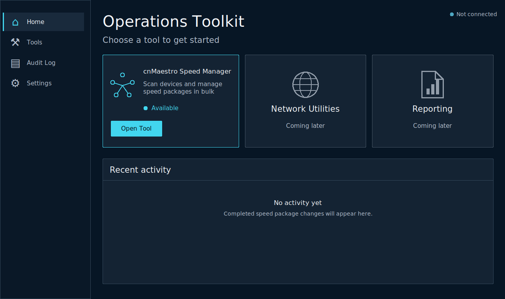
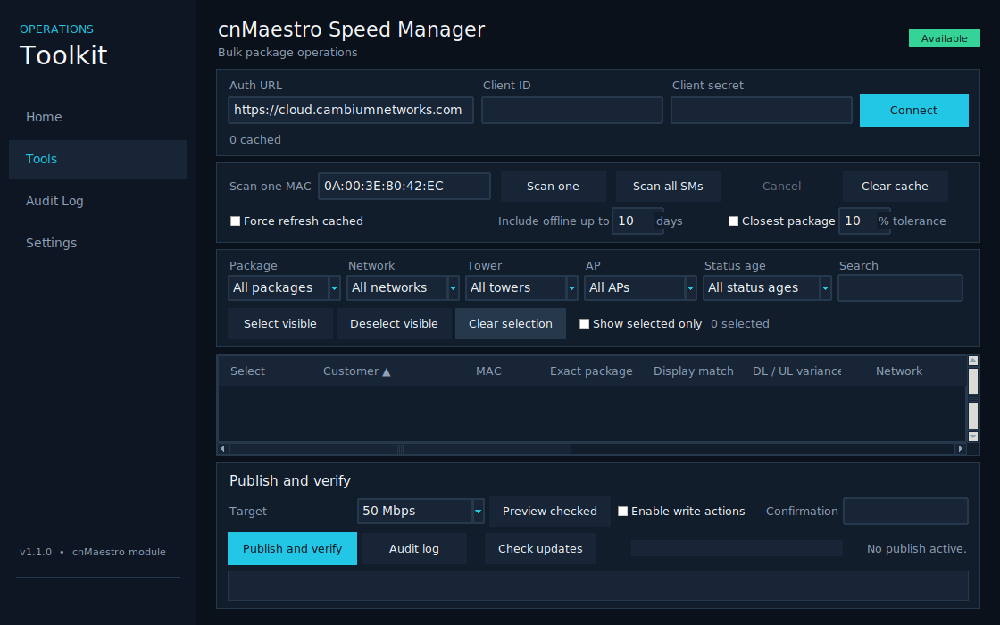
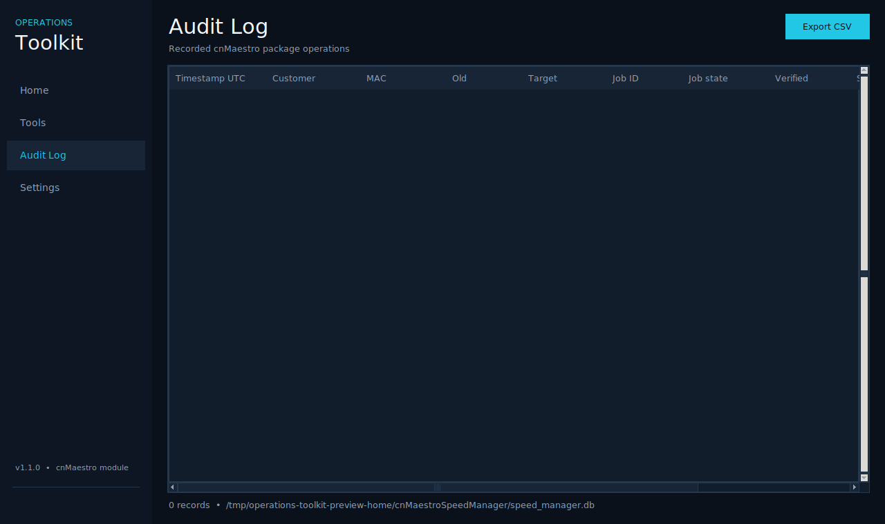
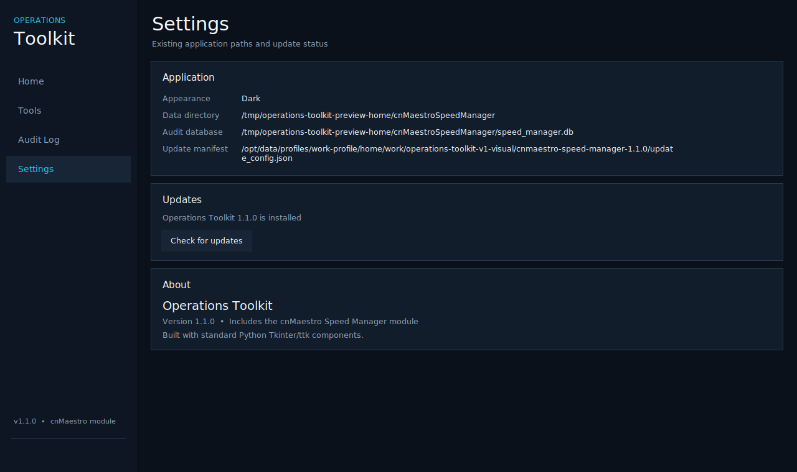

# Operations Toolkit 1.2.0

Operations Toolkit is the working cnMaestro Speed Manager v1.1.0 application with the approved **Concept A** navigation, layout, and branding. Version 1.2.0 is a visual release: cnMaestro API and operational behavior remain AST-equivalent to v1.1.0.

## What changed in 1.2.0

- Renamed the desktop experience to **Operations Toolkit**.
- Added the approved Concept A shell with Home, Tools, Audit Log, and Settings navigation.
- Added the approved dark visual styling, dashboard cards, and Operations Toolkit branding.
- Preserved the v1.1.0 cnMaestro API class, package logic, scan/preview/publish flow, and nonvisual core methods.

No cnMaestro API or backend behavior was redesigned for this release.

## Included v1.1.0 behavior

- Optional closest-downstream package suggestions with adjustable tolerance and visible DL/UL variance. Exact package remains authoritative.
- Sortable columns.
- Persistent checkbox selection across filters, with select/deselect visible and selected-only view.
- Publish progress bar, per-customer stage, success/failure counters, and completion popup.
- System, Light, and Dark appearance modes from the v1.1.0 baseline (the approved Concept A presentation uses Dark).

## Run from source

On Windows, run **Launch Operations Toolkit.bat**. Open **Tools** for the cnMaestro Speed Manager workflow. Keep write actions disabled during validation.

The pinned dependencies are listed in `requirements.txt`.

## Build the Windows executable

Run `build_windows.bat`, or use the equivalent command after installing `requirements.txt`:

```powershell
pyinstaller --noconfirm --clean --onefile --windowed --name "Operations-Toolkit-v1.2.0" cnmaestro_speed_manager.py
```

The executable is written to `dist\Operations-Toolkit-v1.2.0.exe`.

## Regression guard

`release_checks/ast_behavior_guard.py` compares the API class and nonvisual core methods with the original v1.1.0 source by AST. CI also checks Python syntax/import, builds the Windows one-file/windowed executable, and launches the GUI briefly without making cnMaestro calls.

## Concept A screenshots

### Home



### Tools



### Audit Log



### Settings



## Approximate matching safety

Approximate matching changes display/grouping only. Preview retains actual live QoS. The downstream tolerance defaults to 10%. Upload variance is shown but does not determine the suggestion.
